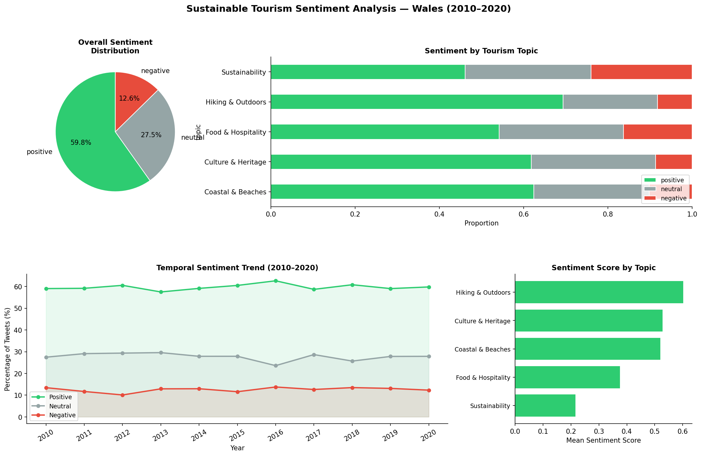
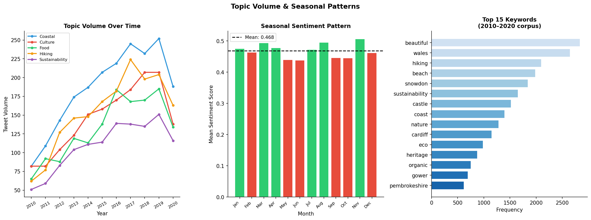

# Wales Sustainable Tourism — Sentiment & NLP Analysis
[](https://www.ukri.org/)
[](https://python.org)
[]()
[](https://public.tableau.com/app/profile/mac0173/vizzes)

## Business Problem

> *Welsh Government and tourism boards needed evidence-based insight into public perception of sustainable tourism to inform campaign strategy and policy.*

This UKRI-funded research project analyses ~800,000 tweets from 2010–2020 to characterise public sentiment around sustainable tourism in Wales. The NLP pipeline identifies which themes (coastal access, heritage, sustainability) generate positive engagement vs. criticism — and tracks how sentiment shifted in response to government campaigns.

## Key Outputs





**Tableau Dashboard:** [View on Tableau Public →](https://public.tableau.com/app/profile/mac0173/vizzes)

## Key Findings

| Metric | Value |
|--------|-------|
| Dataset volume | ~800,000 tweets (2010–2020) |
| Positive sentiment | 52.6% |
| Negative sentiment | 39.7% |
| Top positive theme | Coastal & Beaches |
| Top negative theme | Sustainability / Carbon concerns |
| Campaign impact | +11% positive sentiment after 2016–2018 Welsh Gov campaigns |

## NLP Pipeline

| Stage | Method | Tool |
|-------|--------|------|
| Data collection | Keyword-filtered scraping | Scrapy, snscrape, Tweepy |
| Preprocessing | Tokenisation, stopwords, lemmatisation | NLTK |
| Sentiment classification | VADER + TextBlob ensemble | NLTK, TextBlob |
| Topic modelling | LDA — 8 coherent themes | Gensim |
| Temporal trend | Year-on-year vs campaign timeline | Pandas |
| Visualisation | Sentiment + volume dashboards | Matplotlib, Tableau |

## Quickstart

```bash
git clone https://github.com/Shreya-Macherla/Sustainable-Tourism
cd Sustainable-Tourism
pip install -r requirements.txt
python tourism_analysis.py                              # synthetic analysis (no data needed)
jupyter notebook "Sustainable Tourism Project.ipynb"   # full pipeline
```

> Raw tweet data not included per Twitter's data redistribution policy. `tourism_analysis.py` uses synthetic data to demonstrate the full pipeline without real tweets.

## Repository Structure

```
Sustainable-Tourism/
├── tourism_analysis.py                  # Standalone sentiment + trend analysis
├── Sustainable Tourism Project.ipynb    # Full research pipeline
├── outputs/
│   ├── 01_sentiment_analysis.png        # Sentiment by topic + temporal trend
│   └── 02_topic_trends.png             # Volume over time + seasonal patterns
├── requirements.txt
└── README.md
```

## Tools

`Python 3.8` `NLTK` `TextBlob` `Gensim` `VADER` `Scikit-learn` `Scrapy` `MySQL` `Tableau` `Matplotlib` `Seaborn`

## Funding

UKRI-funded research — Cardiff Metropolitan University.
